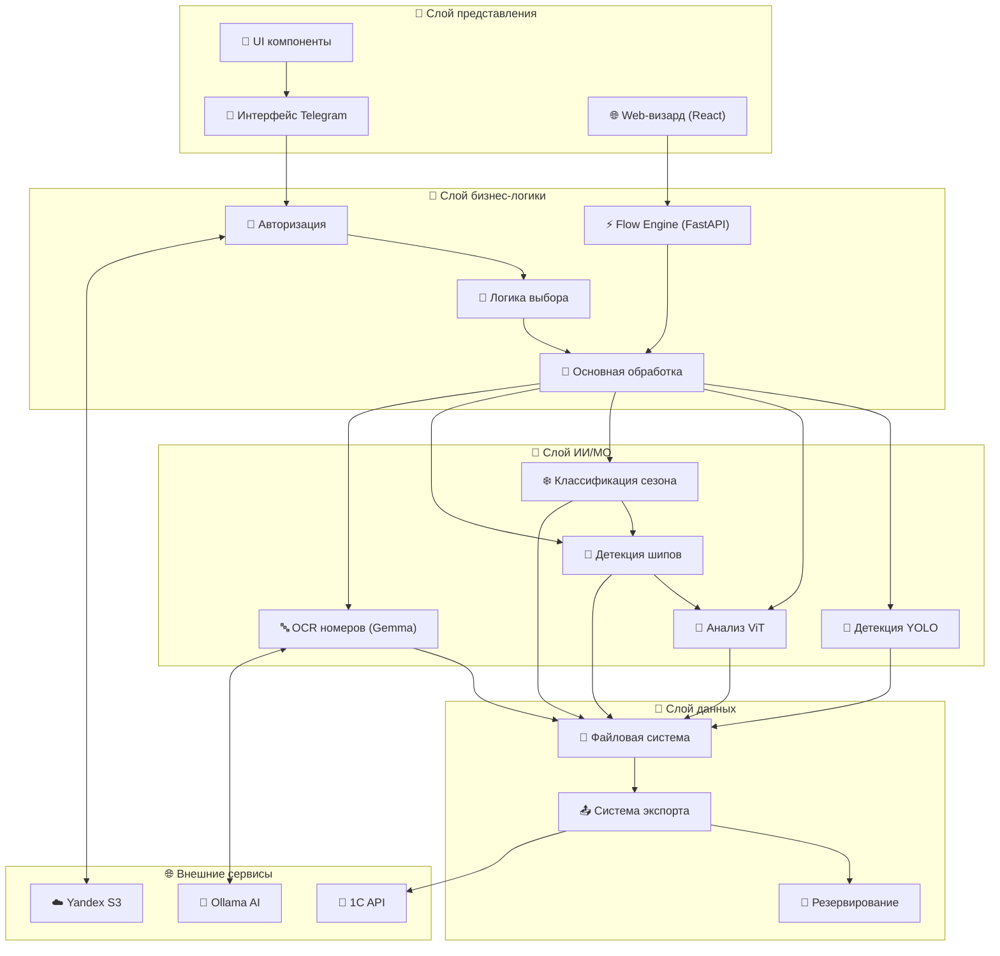
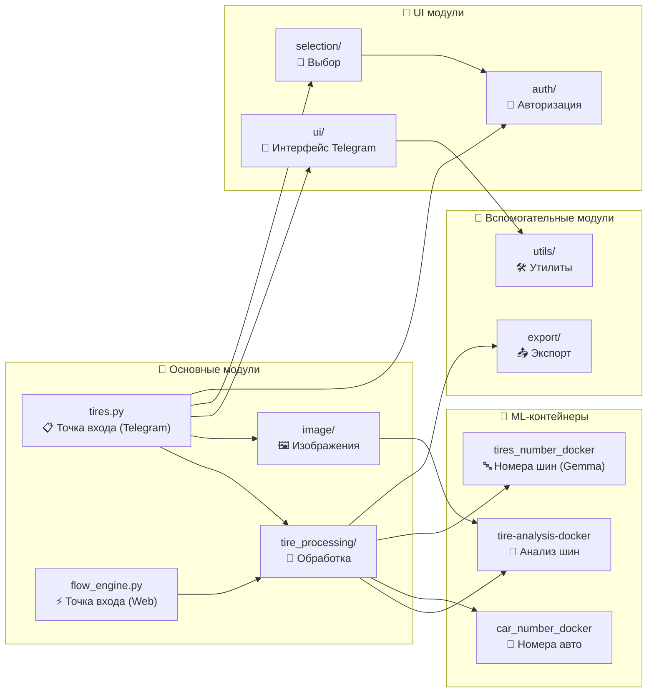
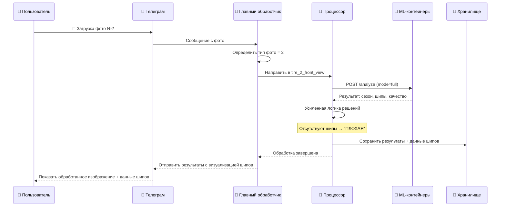
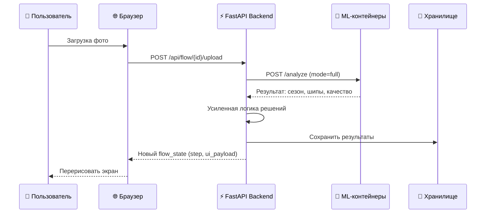
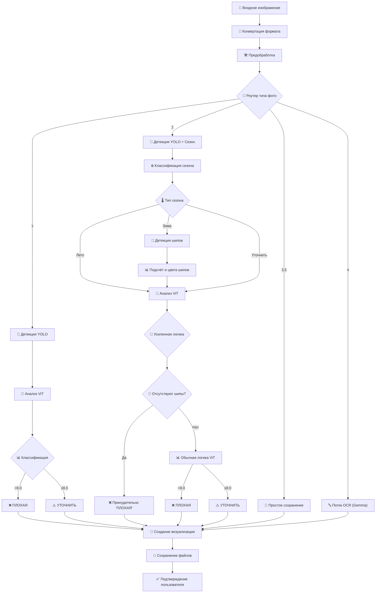

# 🏗️ Архитектура системы ProTires

## 📋 Содержание
- [Общая архитектура](#общая-архитектура)
- [Слои системы](#слои-системы)
- [Модульная структура](#модульная-структура)
- [Потоки данных](#потоки-данных)
- [AI Pipeline](#ai-pipeline)
- [Файловая структура](#файловая-структура)

---

## 🏗️ Общая архитектура

Система построена на основе **многослойной модульной архитектуры** с четким разделением ответственности и двумя каналами взаимодействия:



---

## 🎯 Слои системы

### 1. 🎨 Слой представления
- **📱 Интерфейс Telegram** — `tires.py` (python-telegram-bot)
- **🌐 Web-визард** — React SPA (`web_frontend/src/App.jsx`)
- **🎨 UI компоненты** — модули `ui/` (Telegram), `styles.css` (Web)

### 2. 🧠 Слой бизнес-логики
- **🔐 Авторизация** — `auth/authorization.py` (Telegram), `flow_engine.py` (Web)
- **🧠 Основная обработка** — `core/tire_classification.py` (Telegram), `flow_engine.py` (Web)
- **🎯 Логика выбора** — модули `selection/` (Telegram)
- **⚡ Flow Engine** — `web_backend/app/flow_engine.py` (Web backend)

### 3. 🤖 Слой ИИ/МО (Docker-контейнеры)
- **🎯 Детекция YOLO** — `tire-analysis-docker` (детекция шин)
- **🧠 Анализ ViT** — `tire-analysis-docker` (анализ состояния)
- **❄️ Классификация сезона** — `tire-analysis-docker` (определение сезона)
- **🔩 Детекция шипов** — `tire-analysis-docker` (детекция шипов)
- **🔤 OCR номеров авто** — `car_number_docker` (распознавание гос. номеров)
- **🔤 OCR номеров шин** — `tires_number_docker` (Gemma AI через Ollama)

### 4. 💾 Слой данных
- **📁 Файловая система** — структурированное хранение (`Users/`, `AtWork/`)
- **📤 Система экспорта** — интеграция с 1С
- **🔄 Резервирование** — резервное копирование (Yandex S3)

---

## 🔄 Модульная структура



---

## 📊 Потоки данных

### 🔄 Основной поток обработки (Telegram)



### 🔄 Основной поток обработки (Web)



---

## 🤖 AI Pipeline



---

## 📁 Файловая структура

### 🗂️ Реальная структура проекта

```
ProTires/
├── Telegram_bot/                # 🤖 Telegram-бот
│   ├── tires.py                # 🚀 Главный файл
│   ├── auth/                   # 🔐 Авторизация
│   ├── core/                   # 🧠 Ядро системы
│   ├── image/                  # 🖼️ Обработка изображений
│   ├── tire_processing/        # 🛞 Специализированная обработка
│   │   ├── tire_12_analysis_api.py   # API к tire-analysis-docker
│   │   ├── tire_3_tread_depth.py    # Фото 3 (глубина)
│   │   ├── tire_4_serial_number.py # Фото 4 (OCR через контейнер)
│   │   ├── tire_5_brand_model.py   # Фото 5 (марка/модель)
│   │   ├── tire_additional.py      # Доп. фото
│   │   └── tire_processor.py       # Центральный роутер
│   ├── ui/                     # 🎨 Интерфейс
│   ├── selection/              # 🎯 Выбор источника
│   ├── export/                 # 📤 Экспорт
│   └── utils/                  # 🛠️ Утилиты
├── web_backend/                # ⚡ FastAPI backend
│   ├── app/
│   │   ├── main.py            # Точка входа
│   │   ├── routes.py          # API endpoints
│   │   ├── flow_engine.py     # Оркестрация сессий
│   │   └── settings.py        # Конфигурация
│   ├── Dockerfile
│   └── docker-compose.yml
├── web_frontend/               # 🎨 React SPA
│   ├── src/App.jsx            # Визард
│   ├── styles.css             # Стили
│   └── vite.config.js         # Прокси на backend
├── tire-analysis-docker/       # 🔬 ML-контейнер: анализ шин
│   ├── app/engine.py          # YOLO + ViT + сезон + шипы
│   └── Dockerfile
├── car_number_docker/          # 🔢 ML-контейнер: номера авто
│   ├── app/detector.py        # Распознавание гос. номеров
│   └── Dockerfile
├── tires_number_docker/        # 🔤 ML-контейнер: номера шин
│   ├── app/detector.py        # YOLO-OBB + Gemma OCR
│   └── Dockerfile
├── model/                      # 🧠 ML-модели (веса)
│   ├── yolo_det_class_model.pt
│   ├── good_feats_fp16.pt
│   ├── YOLOv11_cls_summer_winter.pt
│   ├── weights_thorns.pt
│   └── YOLO_OBB_4_tires.pt
├── AtWork/                     # 👥 Данные пользователей
├── Users/                      # 📁 Пользовательские сессии
├── Save_JSON/                  # 💾 Резервные JSON
├── log_upload/                 # 📋 Логи отправки
├── DEMO_img/                   # 🖼️ Демо изображения
├── DATA_txt/                   # 📄 Текстовые данные
├── dir_json/                   # 📁 JSON конфигурации
└── docs/                       # 📖 Документация
```

### 🧠 ML Модели (хранятся в model/)
- `yolo_det_class_model.pt` — детекция шин (tire-analysis-docker)
- `good_feats_fp16.pt` — ViT эмбеддинги (tire-analysis-docker)
- `YOLOv11_cls_summer_winter.pt` — сезонная классификация (tire-analysis-docker)
- `weights_thorns.pt` — детекция шипов (tire-analysis-docker)
- `YOLO_OBB_4_tires.pt` — oriented bounding box для номеров шин (tires_number_docker)

---

### 🔧 Усиленная логика принятия решений
**Для зимних шин:**
- Отсутствие шипов → принудительно "ПЛОХАЯ"
- Наличие шипов → стандартная ViT логика

**Для летних шин:**
- Стандартная ViT классификация

### 📊 JSON экспорт включает:
```json
{
  "tire_analysis": {
    "season": "Зимняя шина",
    "season_confidence": 0.95,
    "spikes": {
      "Да": 15,
      "Нет": 2,
      "Другое": 1
    },
    "enhanced_decision": "Missing spikes detected → ПЛОХАЯ"
  }
}
```
