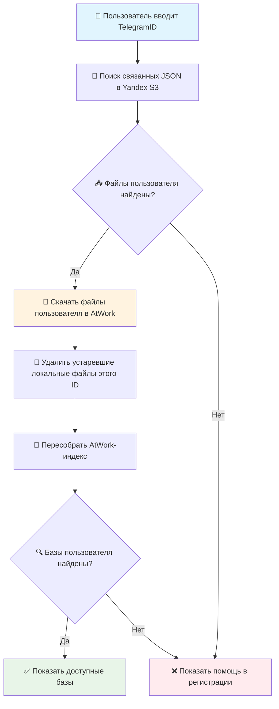

# 🔐 Система авторизации ProTires

## 📋 Общее описание

Авторизация в обоих каналах (Telegram-бот и Web) работает на основе сравнения идентификатора пользователя с данными в JSON-файлах, синхронизируемых с Yandex Cloud S3 в папку `AtWork/`.

- **Telegram-бот** — авторизация по `Telegram ID` (получается автоматически из Telegram).
- **Web-приложение** — авторизация по `Telegram ID` (вводится вручную, см. раздел [«Авторизация в Web-версии»](#-авторизация-в-web-версии)).

Ниже сначала описана логика синхронизации S3 (общая для обоих каналов), затем — специфика web-авторизации.

## 🚨 Проблема рассинхронизации (решена в v2.0)

### **Описание проблемы**

До версии 2.0 система имела критический недостаток в логике синхронизации файлов пользователей между S3 и локальной файловой системой.

### **Сценарий проблемы:**

1. **Начальное состояние:**
   - Пользователь "Есенин М.С." имел в S3: `"TelegramID": "135411224458"`
   - Файл был загружен в локальную папку `AtWork/`

2. **Изменение данных:**
   - Администратор изменил в S3: `"TelegramID": "999999999"`
   - Файл в S3 обновился

3. **Проблема при /start:**
   - Функция `sync_s3_bucket_to_local()` проверяла только наличие файлов
   - Логика: "Файл есть локально ✅, файл есть в S3 ✅ → синхронизация не нужна"
   - **Содержимое файлов НЕ сравнивалось!**

4. **Результат:**
   - Пользователь не мог войти с новым TelegramID
   - Требовалось ручное удаление файла из `AtWork/`

### **Код старой проблемной логики:**

```python
# ❌ ПРОБЛЕМНАЯ ВЕРСИЯ
local_files = {file.name for file in work_path.iterdir() if file.is_file()}
missing_files = [
    file for file in bucket_keys
    if file.endswith('.json') and Path(file).name not in local_files
]

# Скачивались только ОТСУТСТВУЮЩИЕ файлы
# Существующие файлы НЕ ПРОВЕРЯЛИСЬ на изменения!
```

## ✅ Текущее решение: точечное обновление пользователя из S3

### **Принцип работы новой системы:**

1. **📥 Получение метаданных из S3:**
   - backend читает список JSON-файлов в `S3_PREFIX`, например `AITyres/users/`;
   - сохраняет ETag, дату изменения, размер и связь файла с `TelegramID` / `BitrixID` в `AtWork/.s3_manifest.json`.

2. **🔍 Поиск файлов конкретного пользователя:**
   - по введенному `TelegramID` backend находит только связанные с ним S3-ключи;
   - весь bucket в `AtWork/` не скачивается.

3. **📥 Обновление локального AtWork:**
   - все найденные файлы конкретного пользователя скачиваются заново при каждой авторизации;
   - если у пользователя изменилась база, `ConnectionString`, ссылка или другой профильный параметр, локальный `AtWork/` получает актуальную версию сразу при следующем входе;
   - локальные файлы этого же пользователя, которых больше нет в S3, удаляются как устаревшие.

4. **🔄 Обновление индекса:**
   - после синхронизации пересобирается `AtWork/.index_bitrix.json`;
   - авторизация идет уже по обновленным локальным данным.

### **Код нового решения:**

```python
# Упрощенная схема текущей web-авторизации
async def authenticate_web_user(telegram_id: str) -> bool:
    await sync_user_from_s3(telegram_id)       # обновляем только этого пользователя
    bases = find_user_bases_by_id(telegram_id) # ищем уже в обновленном AtWork
    return bool(bases)

def sync_user_from_s3(bitrix_id: str):
    manifest = load_or_refresh_s3_manifest()
    user_keys = manifest["user_files"].get(bitrix_id, [])

    for key in user_keys:
        # Скачиваем найденные файлы пользователя при каждом входе,
        # даже если локальная копия уже есть.
        s3.download_file(bucket_name, key, atwork_path / Path(key).name)

    remove_stale_local_files_for_user(bitrix_id, user_keys)
    rebuild_atwork_index()
```

## 🔄 Поведение при входе пользователя

### **Что происходит после ввода TelegramID:**

1. Backend принимает `TelegramID`.
2. Backend обращается к Yandex Bucket и обновляет JSON-файлы только этого пользователя.
3. Backend пересобирает локальный индекс `AtWork`.
4. Backend ищет доступные базы пользователя в обновленном `AtWork`.
5. Если базы найдены, web-визард открывает шаг выбора базы.
6. Если пользователь не найден, web-визард показывает официальное сообщение и кнопку помощи в регистрации.

Важно: текущая web-логика не полагается только на уже существующий локальный файл в `AtWork/`. Даже если файл есть локально, backend заново скачивает найденные S3-файлы этого пользователя, чтобы исключить вечную ошибку из-за устаревшей базы или ссылки подключения.

Если старый клиент продолжает отправлять `surname`, `last_name` или `family_name`, backend игнорирует эти поля. Доступ определяется только по найденному `TelegramID` / `BitrixID`.

## 📊 Производительность

### **Времена выполнения:**

| Сценарий | Время /start | Описание |
|----------|--------------|----------|
| **Обычный режим** | 3-5 сек | Поиск файлов пользователя в S3 + скачивание только его JSON |
| **Новый пользователь** | +1-2 сек | Manifest обновляется, найденный файл пользователя скачивается в `AtWork` |
| **Данные изменились в S3** | 3-5 сек | Новый JSON пользователя перезаписывает локальную копию |
| **ID не найден** | 2-4 сек | Backend проверяет S3/manifest и возвращает `access_denied` |

### **Оптимизации:**

- ✅ Скачиваются только файлы конкретного пользователя, а не весь bucket
- ✅ Локальный `AtWork` остается актуальным при изменении базы или ссылки подключения
- ✅ Manifest хранит связь S3-файлов с `TelegramID` / `BitrixID`
- ✅ Устаревшие локальные файлы конкретного пользователя удаляются автоматически

## 🔧 Конфигурация

### **Переменные окружения (.env):**

```bash
# Директория для хранения файлов авторизации
ATWORK_DIR=/home/ProTires/Telegram-bot-tires/AtWork

# S3 настройки
AWS_ACCESS_KEY_ID=your_access_key
AWS_SECRET_ACCESS_KEY=your_secret_key
S3_PREFIX=AITyres/users/

# Директория пользовательских сессий
USERS_DIR=/home/ProTires/Telegram-bot-tires/Users
```

### **Структура файла пользователя:**

```json
[
  {
    "UID": "cf52560a-4cb5-11e5-80bc-10604ba895d8",
    "TelegramID": "389970221",
    "Name": "Василенко Анна Борисовна",
    "EMail": "a.vasilenko@resourcegroup.ru",
    "IDCompany": "5032b697-1a47-11e5-be74-00155dc6002b",
    "NameCompany": "Филиал ООО \"РесурсТранс\" в г. Калининград",
    "INN": "7714731464",
    "KPP": "390643001",
    "ConnectionString": "http://ws-pub1c:800/RT83_ATP_KLG_TEST3",
    "BaseName": "АТП КАЛИНИНГРАД"
  }
]
```

## 🚀 Алгоритм авторизации при /start



## 🛠️ Диагностика и мониторинг

### **Логи синхронизации:**

```bash
# Успешное точечное обновление пользователя
INFO - Per-user S3 sync done for BitrixID=5652315164: downloaded=1, matched=1

# Локальный файл этого ID больше не связан с S3 и удален
INFO - Removed stale AtWork file for BitrixID=5652315164: old_user_file.json

# Пользователь не найден после S3-проверки
WARNING - Access denied for TelegramID=999999999999999 after S3 sync error: ...
```

### **Команды для диагностики:**

```bash
# Проверка текущих файлов авторизации
ls -la /home/ProTires/Telegram-bot-tires/AtWork/

# Просмотр логов бота
tail -f /var/log/protires-bot.log | grep -E "(синхронизация|Пользователь.*найден)"

# Принудительная пересинхронизация (если нужно)
rm /home/ProTires/Telegram-bot-tires/AtWork/*.json
# Файлы будут загружены заново при следующем /start
```

## ✅ Преимущества новой системы

1. **🔄 Автоматическое обнаружение изменений**
   - Любые изменения в S3 автоматически подтягиваются
   - Не нужно ручное вмешательство администратора

2. **⚡ Оптимальная производительность**
   - Загружаются только файлы конкретного пользователя
   - Время /start остается приемлемым даже для 100+ пользователей

3. **🛡️ Защита от устаревшего AtWork**
   - Файлы пользователя скачиваются заново при каждом входе
   - Изменение базы или ссылки подключения в S3 подтягивается при следующей авторизации

4. **📊 Подробное логирование**
   - Все операции синхронизации записываются в лог
   - Легко диагностировать проблемы

5. **🔧 Простота администрирования**
   - Администратор работает только с S3
   - Локальные файлы синхронизируются автоматически

## 🌐 Авторизация в Web-версии

В отличие от Telegram-бота, web-приложение не знает Telegram ID автоматически, поэтому пользователь вводит его вручную.

### Поток авторизации

1. На стартовом экране (или на шаге `select_user`) пользователь вводит **Telegram ID**.
2. Frontend отправляет `POST /api/flow/start` с телом:

```json
{ "TelegramID": "389970221" }
```

> `BitrixID` — legacy-алиас того же идентификатора; оба поля указывают на один и тот же `TelegramID` в `AtWork/`.

3. Backend точечно синхронизирует профиль пользователя из S3: скачивает найденные JSON-файлы этого ID заново при каждом входе.
4. Backend ищет базы по ID в найденном профиле.
5. Результат:
   - **Профиль найден** → в сессии ставится флаг `auth_verified`, открывается выбор базы (`select_base`).
   - **Профиль не найден** → возврат на шаг `select_user` с ошибкой `access_denied`.

### Локальный индекс AtWork

Для web-авторизации backend не сканирует все файлы `AtWork/` на каждый запрос. Он строит и поддерживает индекс:

- `AtWork/.index_bitrix.json` — быстрый поиск по `BitrixID` / `TelegramID`;
- `AtWork/.s3_manifest.json` — метаданные S3 и связь файлов с `TelegramID` / `BitrixID`.

Служебные файлы `.index_bitrix.json`, `.index_telegram.json`, `.s3_manifest.json` не индексируются как пользовательские профили.
Если предыдущий запуск оставил пустой или частично построенный индекс при наличии JSON-файлов в `AtWork/`, backend принудительно пересобирает индекс при следующем поиске.

Практическая диагностика:

```powershell
cd B:\Tires_Bitrix
@'
from web_backend.app.flow_engine import FlowEngine
engine = FlowEngine()
idx = engine._refresh_atwork_index()
print("indexed_files", len(idx.get("files", {})))
print("indexed_ids", len(idx.get("by_bitrix", {})))
print("user", idx.get("by_bitrix", {}).get("5652315164"))
'@ | python -
```

Если `user` пустой, проверьте:

- есть ли файл пользователя в `AtWork/`;
- корректны ли поля `TelegramID` или `BitrixID`;
- не поврежден ли JSON;
- установлен ли `boto3`, если пользователь должен подтягиваться из S3.

Сообщение `boto3 is not installed, S3 user sync skipped` означает, что S3-синхронизация пропущена. Локальный `AtWork/` при этом всё равно используется.

### Защита от обхода

- Действие `select_base` на бэкенде отклоняется, если в сессии нет `auth_verified` — нельзя пропустить авторизацию, отправив действие напрямую.
- И `flow/start`, и действие `select_user` используют единую функцию проверки `_authenticate_web_user`, поэтому правила одинаковы на всех точках входа.

### Сообщение об ошибке

| Код | Сообщение для пользователя |
|-----|-----------------------------|
| `access_denied` | Пользователь с указанным Telegram ID не найден. Проверьте корректность введенных данных. Если ID указан верно, обратитесь к ответственному сотруднику для помощи в регистрации. |

Для `access_denied` backend также возвращает:

```json
{
  "registration_help_url": "https://portal.rt24.ru/company/personal/user/4212/",
  "registration_help_label": "Помощь в регистрации"
}
```

Frontend показывает кнопку регистрации и не выводит технические поля S3/индекса пользователю.

### Проверка ID

Backend считает доступ подтвержденным, если после S3-синхронизации найден хотя бы один профиль/база с переданным `TelegramID` или `BitrixID`.

## 🔮 Будущие улучшения

- **📈 Кэширование метаданных** - сохранение ETag локально для ускорения
- **⏰ Периодическая синхронизация** - обновление в фоне каждые N минут
- **📊 Метрики производительности** - отслеживание времени синхронизации
- **🔔 Уведомления об изменениях** - оповещение администраторов о проблемах 
