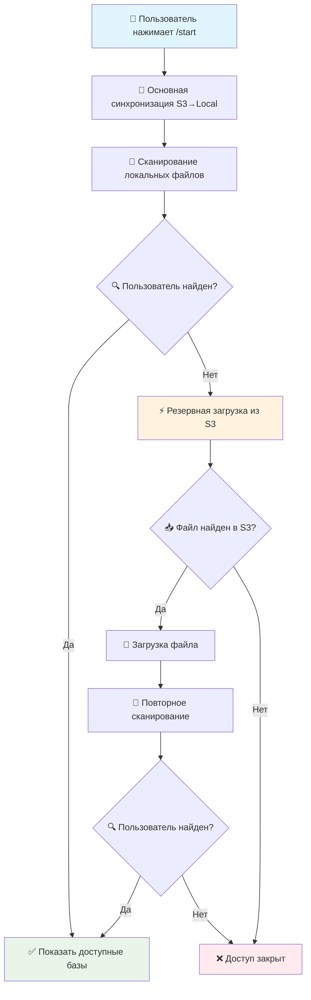

# 🔐 Система авторизации ProTires

## 📋 Общее описание

Авторизация в обоих каналах (Telegram-бот и Web) работает на основе сравнения идентификатора пользователя с данными в JSON-файлах, синхронизируемых с Yandex Cloud S3 в папку `AtWork/`.

- **Telegram-бот** — авторизация по `Telegram ID` (получается автоматически из Telegram).
- **Web-приложение** — авторизация по `Telegram ID` + `фамилия` (вводятся вручную, см. раздел [«Авторизация в Web-версии»](#-авторизация-в-web-версии)).

Ниже сначала описана логика синхронизации S3 (общая для обоих каналов), затем — специфика web-авторизации.

## 🚨 Проблема рассинхронизации (решена в v2.0)

### **Описание проблемы**

До версии 2.0 система имела критический недостаток в логике синхронизации файлов пользователей между S3 и локальной файловой системой.

### **Сценарий проблемы:**

1. **Начальное состояние:**
   - Пользователь "Есенин М.С." имел в S3: `"TelegramID": "135411224458"`
   - Файл был загружен в локальную папку `AtWork/`

2. **Изменение данных:**
   - Администратор изменил в S3: `"TelegramID": "999999999"`
   - Файл в S3 обновился

3. **Проблема при /start:**
   - Функция `sync_s3_bucket_to_local()` проверяла только наличие файлов
   - Логика: "Файл есть локально ✅, файл есть в S3 ✅ → синхронизация не нужна"
   - **Содержимое файлов НЕ сравнивалось!**

4. **Результат:**
   - Пользователь не мог войти с новым TelegramID
   - Требовалось ручное удаление файла из `AtWork/`

### **Код старой проблемной логики:**

```python
# ❌ ПРОБЛЕМНАЯ ВЕРСИЯ
local_files = {file.name for file in work_path.iterdir() if file.is_file()}
missing_files = [
    file for file in bucket_keys
    if file.endswith('.json') and Path(file).name not in local_files
]

# Скачивались только ОТСУТСТВУЮЩИЕ файлы
# Существующие файлы НЕ ПРОВЕРЯЛИСЬ на изменения!
```

## ✅ Решение: Синхронизация по MD5/ETag

### **Принцип работы новой системы:**

1. **📥 Получение метаданных из S3:**
   - Извлекается ETag каждого файла (MD5 хеш содержимого)
   - Сохраняется информация о всех файлах в S3

2. **🔍 Проверка локальных файлов:**
   - Вычисляется MD5 каждого локального файла
   - Сравнивается с ETag из S3

3. **⚖️ Принятие решения:**
   - MD5 разные → файл изменился → перезагружаем
   - MD5 одинаковые → файл актуален → оставляем
   - Файла нет локально → загружаем
   - Файла нет в S3 → удаляем локально

### **Код нового решения:**

```python
# ✅ ИСПРАВЛЕННАЯ ВЕРСИЯ
def calculate_md5(file_path: Path) -> str:
    """Вычисляет MD5 хеш локального файла"""
    hash_md5 = hashlib.md5()
    with file_path.open("rb") as f:
        for chunk in iter(lambda: f.read(4096), b""):
            hash_md5.update(chunk)
    return hash_md5.hexdigest()

# Получаем ETag из S3
s3_files = {}
for obj in s3_objects:
    if obj['Key'].endswith('.json'):
        filename = Path(obj['Key']).name
        etag = obj['ETag'].strip('"')  # MD5 хеш из S3
        s3_files[filename] = {'etag': etag, 'key': obj['Key']}

# Проверяем каждый файл
for filename, s3_info in s3_files.items():
    local_file = work_path / filename
    s3_etag = s3_info['etag']
    
    if filename not in local_files:
        # Файла нет локально - скачиваем
        should_download = True
    else:
        # Файл есть - сравниваем содержимое по MD5
        local_md5 = calculate_md5(local_file)
        should_download = (local_md5 != s3_etag)
    
    if should_download:
        # Загружаем обновленный файл
        s3.download_file(bucket_name, s3_key, str(local_file))
```

## 🔄 Дополнительная защита: Ленивая загрузка

### **Резервный механизм на случай сбоев:**

Если пользователь не найден в локальных файлах, система автоматически:

1. **🔍 Ищет пользователя в S3** по TelegramID
2. **📥 Загружает его файл** если найден
3. **🔄 Повторяет авторизацию** с обновленными данными

```python
async def find_user_bases(user_id: str, try_sync_on_fail: bool = True) -> list:
    # Сначала ищем в локальных файлах
    user_bases = scan_local_files()
    
    # Если не найден - пробуем загрузить из S3
    if not user_bases and try_sync_on_fail:
        if await sync_user_file_on_demand(user_id):
            user_bases = scan_local_files()  # Повторный поиск
    
    return list(user_bases)
```

## 📊 Производительность

### **Времена выполнения:**

| Сценарий | Время /start | Описание |
|----------|--------------|----------|
| **Обычный режим** | 3-5 сек | Проверка MD5 всех файлов + загрузка изменений |
| **Новый пользователь** | +1-2 сек | Дополнительная загрузка из S3 по требованию |
| **Нет изменений** | 2-3 сек | Только проверка MD5, загрузки нет |

### **Оптимизации:**

- ✅ MD5 вычисляется только для локальных файлов
- ✅ ETag получается "бесплатно" из метаданных S3
- ✅ Загружаются только измененные файлы
- ✅ Резервная загрузка срабатывает только при необходимости

## 🔧 Конфигурация

### **Переменные окружения (.env):**

```bash
# Директория для хранения файлов авторизации
ATWORK_DIR=/home/ProTires/Telegram-bot-tires/AtWork

# S3 настройки
AWS_ACCESS_KEY_ID=your_access_key
AWS_SECRET_ACCESS_KEY=your_secret_key
S3_PREFIX=AITyres/users/

# Директория пользовательских сессий
USERS_DIR=/home/ProTires/Telegram-bot-tires/Users
```

### **Структура файла пользователя:**

```json
[
  {
    "UID": "cf52560a-4cb5-11e5-80bc-10604ba895d8",
    "TelegramID": "389970221",
    "Name": "Василенко Анна Борисовна",
    "EMail": "a.vasilenko@resourcegroup.ru",
    "IDCompany": "5032b697-1a47-11e5-be74-00155dc6002b",
    "NameCompany": "Филиал ООО \"РесурсТранс\" в г. Калининград",
    "INN": "7714731464",
    "KPP": "390643001",
    "ConnectionString": "http://ws-pub1c:800/RT83_ATP_KLG_TEST3",
    "BaseName": "АТП КАЛИНИНГРАД"
  }
]
```

## 🚀 Алгоритм авторизации при /start



## 🛠️ Диагностика и мониторинг

### **Логи синхронизации:**

```bash
# Успешная синхронизация
INFO - 📥 Новый файл: Иванов_АТП_МОСКВА.json
INFO - 🔄 Файл изменен в S3: Петров_АТП_СПБ.json (локальный MD5: a1b2c3d4..., S3 ETag: x9y8z7w6...)
INFO - ✅ Обновлен файл: Петров_АТП_СПБ.json
INFO - 🗑️ Удален файл (отсутствует в S3): Старый_файл.json
INFO - 🎉 Синхронизация завершена. Обработано файлов: 45

# Резервная загрузка
INFO - 🔍 Пользователь 123456789 не найден локально, пробуем загрузить из S3...
INFO - 📥 Загружаем новый файл для пользователя 123456789: Сидоров_АТП_КАЗАНЬ.json
INFO - ✅ Пользователь 123456789 найден после синхронизации с S3
```

### **Команды для диагностики:**

```bash
# Проверка текущих файлов авторизации
ls -la /home/ProTires/Telegram-bot-tires/AtWork/

# Просмотр логов бота
tail -f /var/log/protires-bot.log | grep -E "(синхронизация|Пользователь.*найден)"

# Принудительная пересинхронизация (если нужно)
rm /home/ProTires/Telegram-bot-tires/AtWork/*.json
# Файлы будут загружены заново при следующем /start
```

## ✅ Преимущества новой системы

1. **🔄 Автоматическое обнаружение изменений**
   - Любые изменения в S3 автоматически подтягиваются
   - Не нужно ручное вмешательство администратора

2. **⚡ Оптимальная производительность**
   - Загружаются только измененные файлы
   - Время /start остается приемлемым даже для 100+ пользователей

3. **🛡️ Двойная защита от сбоев**
   - Основная синхронизация + резервная загрузка по требованию
   - Система восстанавливается от большинства проблем автоматически

4. **📊 Подробное логирование**
   - Все операции синхронизации записываются в лог
   - Легко диагностировать проблемы

5. **🔧 Простота администрирования**
   - Администратор работает только с S3
   - Локальные файлы синхронизируются автоматически

## 🌐 Авторизация в Web-версии

В отличие от Telegram-бота, web-приложение не знает Telegram ID автоматически, поэтому пользователь вводит его вручную вместе с фамилией для двойной проверки.

### Поток авторизации

1. На стартовом экране (или на шаге `select_user`) пользователь вводит **Telegram ID** и **фамилию**.
2. Frontend отправляет `POST /api/flow/start` с телом:

```json
{ "TelegramID": "389970221", "surname": "Василенко" }
```

> `BitrixID` — legacy-алиас того же идентификатора; оба поля указывают на один и тот же `TelegramID` в `AtWork/`.

3. Backend синхронизирует профиль пользователя из S3 (та же логика MD5/ETag + ленивая загрузка по ID, что и у бота).
4. Backend ищет базы по ID и проверяет, что введённая фамилия совпадает с первым токеном поля `Name` в найденном профиле.
5. Результат:
   - **Совпало** → в сессии ставится флаг `auth_verified`, открывается выбор базы (`select_base`).
   - **Не совпало / не найдено** → возврат на шаг `select_user` с ошибкой `access_denied`.

### Локальный индекс AtWork

Для web-авторизации backend не сканирует все файлы `AtWork/` на каждый запрос. Он строит и поддерживает индекс:

- `AtWork/.index_bitrix.json` — быстрый поиск по `BitrixID` / `TelegramID`;
- `AtWork/.s3_manifest.json` — метаданные S3 для ленивой синхронизации.

Служебные файлы `.index_bitrix.json`, `.index_telegram.json`, `.s3_manifest.json` не индексируются как пользовательские профили.
Если предыдущий запуск оставил пустой или частично построенный индекс при наличии JSON-файлов в `AtWork/`, backend принудительно пересобирает индекс при следующем поиске.

Практическая диагностика:

```powershell
cd B:\Tires_Bitrix
@'
from web_backend.app.flow_engine import FlowEngine
engine = FlowEngine()
idx = engine._refresh_atwork_index()
print("indexed_files", len(idx.get("files", {})))
print("indexed_ids", len(idx.get("by_bitrix", {})))
print("user", idx.get("by_bitrix", {}).get("5652315164"))
'@ | python -
```

Если `user` пустой, проверьте:

- есть ли файл пользователя в `AtWork/`;
- корректны ли поля `TelegramID` или `BitrixID`;
- не поврежден ли JSON;
- установлен ли `boto3`, если пользователь должен подтягиваться из S3.

Сообщение `boto3 is not installed, S3 user sync skipped` означает, что S3-синхронизация пропущена. Локальный `AtWork/` при этом всё равно используется.

### Защита от обхода

- Действие `select_base` на бэкенде отклоняется, если в сессии нет `auth_verified` — нельзя пропустить авторизацию, отправив действие напрямую.
- И `flow/start`, и действие `select_user` используют единую функцию проверки `_authenticate_web_user`, поэтому правила одинаковы на всех точках входа.

### Сообщение об ошибке

| Код | Сообщение для пользователя |
|-----|-----------------------------|
| `access_denied` | В доступе отказано, проверьте введенные данные |

Технический код (`access_denied`) пользователю не показывается — в UI отображается только текст сообщения.

### Сверка фамилии

```python
# Нормализация (без регистра, лишних символов) и сравнение
# с первым токеном поля "Name" из профиля AtWork/
def _surname_matches_user_bases(bases, surname) -> bool:
    target = _normalize_surname(surname)
    for base in bases:
        name = str(base.get("Name", "")).strip()
        first_token = name.split()[0] if name else ""
        if _normalize_surname(first_token) == target:
            return True
    return False
```

## 🔮 Будущие улучшения

- **📈 Кэширование метаданных** - сохранение ETag локально для ускорения
- **⏰ Периодическая синхронизация** - обновление в фоне каждые N минут
- **📊 Метрики производительности** - отслеживание времени синхронизации
- **🔔 Уведомления об изменениях** - оповещение администраторов о проблемах 
