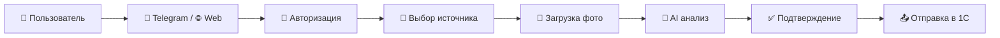

# 🚀 ProTires — Система анализа автомобильных шин

## 📋 Навигация по документации

- **[📖 Общий обзор](#обзор-проекта)** — Назначение и возможности системы
- **[📱 Инструкция пользователя](USER_GUIDE.md)** — Подробное руководство по использованию бота
- **[🏗️ Архитектура](ARCHITECTURE.md)** — Подробная архитектура системы
- **[🔐 Авторизация](Auth.md)** — Система авторизации и S3-синхронизация
- **[🔌 Bitrix API](bitrix_api.md)** — Документация API для интеграции

---

## 📖 Обзор проекта

**ProTires** — это интеллектуальная система для списания шин.

### 🎯 Основное назначение
Система предназначена для автоматизации процесса оценки состояния шин на складах и в транспортных компаниях с использованием технологий компьютерного зрения и искусственного интеллекта, включая определение сезонности и анализ шипов зимних шин.

### ✨ Ключевые возможности

#### 🤖 Искусственный интеллект
- **YOLO v11** — детекция шин на изображениях
- **ViT (Vision Transformer)** — анализ износа и дефектов
- **YOLOv11 Season Classifier** — определение сезона шин (лето/зима/уточнить)
- **YOLO Spike Detection** — детекция и подсчёт шипов на зимних шинах
- **Gemma AI OCR** — распознавание серийных номеров через Ollama

#### 📱 Пользовательский интерфейс
- **Web-визард** — React + Vite, интеграция с Bitrix24
- **Авторизация web** — Telegram/Bitrix ID + фамилия, проверка через AtWork/S3
- **Поддержка HEIC** — работа с фото от iPhone
- **Пошаговые инструкции** — с демо-изображениями
- **Подтверждение результатов** — контроль пользователя
- **Цветовая индикация шипов** — зелёный (есть), красный (нет), жёлтый (посторонние предметы)

#### 🏭 Бизнес-интеграция
- **Интеграция с 1С** — автоматическая отправка данных
- **Bitrix24** — интеграция web-интерфейса
- **Учёт по складам** — разделение по базам данных
- **Транспортная логистика** — учёт по автомобилям
- **Резервное копирование** — сохранность данных
- **Сезонный анализ** — автоматическое определение типа шин

### 📊 Технические характеристики

| Параметр | Значение |
|----------|----------|
| **Время обработки** | 3–7 сек/фото |
| **Поддерживаемые форматы** | JPEG, PNG, HEIC, HEIF, BMP, GIF, TIFF |
| **Максимальное разрешение** | 4K (3840×2160) |
| **Точность детекции** | >95% |
| **Точность классификации** | >92% |
| **Точность определения сезона** | >90% |
| **Точность детекции шипов** | >88% |
| **GPU ускорение** | До 5× быстрее CPU |

### 🔄 Процесс работы



### 🛞 Типы анализируемых фотографий

1. **📷 Фото 1 — Боковой вид**
   - Общий вид протектора сбоку
   - YOLO детекция + ViT анализ состояния

2. **📷 Фото 2 — Фронтальный вид** ⭐ **РАСШИРЕННЫЙ АНАЛИЗ**
   - Шина спереди для оценки симметрии
   - **Определение сезона шин** (лето/зима/уточнить)
   - **Детекция шипов** для зимних шин с цветовой индикацией:
     - 🟢 **Зелёный** — шипы присутствуют ("Да")
     - 🔴 **Красный** — шипы отсутствуют ("Нет")
     - 🟡 **Жёлтый** — посторонние предметы ("Другое")
   - **Усиленная логика принятия решений** — отсутствие шипов → "Плохая"
   - Анализ равномерности износа + ViT анализ

3. **📷 Фото 3 — Измерение глубины**
   - Фото с измерительным инструментом
   - Определение остаточной глубины протектора

4. **📷 Фото 4 — Серийный номер**
   - AI OCR распознавание номера (Gemma через Ollama)
   - Автоматическое извлечение текста

5. **📷 Фото 5 — Марка и модель**
   - Сохранение фото для идентификации

### 🎨 Результаты классификации

Система автоматически классифицирует состояние шин с учётом сезонного анализа:

#### 📷 Фото 1 (Боковой вид):
- **❌ ПЛОХАЯ** — критический износ или повреждения (ViT > 8.0)
- **⚠️ УТОЧНИТЬ** — требуется дополнительная проверка (ViT ≤ 8.0)

#### 📷 Фото 2 (Фронтальный вид) — Расширенная логика:

**☀️ Летние шины:**
- **❌ ПЛОХАЯ** — критический износ (ViT > 8.0)
- **⚠️ УТОЧНИТЬ** — требуется проверка (ViT ≤ 8.0)

**❄️ Зимние шины:**
- **❌ ПЛОХАЯ** — критический износ (ViT > 8.0) ИЛИ отсутствие шипов ("Нет" > 0)
- **⚠️ УТОЧНИТЬ** — требуется проверка (ViT ≤ 8.0 И все шипы на месте)

**❓ Неопределённые шины:**
- Стандартная ViT логика без анализа шипов

### 🏢 Области применения

#### 🏭 Склады шин
- Списание шин со склада

#### 🚛 Транспортные компании
- Списание шин с транспорта

---

## 🚀 Быстрый старт

### 1. 📋 Требования
- Python 3.11+
- CUDA (для GPU ускорения)
- 16GB RAM минимум
- 200GB свободного места
- **Дополнительные модели:**
  - `YOLOv11_cls_summer_winter.pt` — классификация сезона
  - `weights_thorns.pt` — детекция шипов

### 2. ⚙️ Установка
```bash
# Клонирование репозитория
git clone <repository-url>
cd ProTires

# Установка зависимостей
pip install -r Telegram_bot/requirements.txt
pip install -r web_backend/requirements.txt

# Настройка окружения
cp .env.example .env
# Отредактируйте .env файл
```

### 3. 🤖 Запуск
```bash
# Telegram-бот
cd Telegram_bot
python tires.py

# Web backend
cd web_backend
python -m uvicorn app.main:app --host 0.0.0.0 --port 18080

# Web frontend
cd web_frontend
npm install
npm run dev
```

### 4. 📱 Использование
1. Найдите бота в Telegram
2. Отправьте `/start`
3. Выберите источник (склад/транспорт)
4. Укажите количество шин
5. Загружайте фото по инструкциям
6. Подтверждайте результаты
7. Отправляйте данные в 1С систему

📖 **Подробная инструкция**: Смотрите [USER_GUIDE.md](USER_GUIDE.md) для пошагового руководства с детальными объяснениями каждого шага.

---
